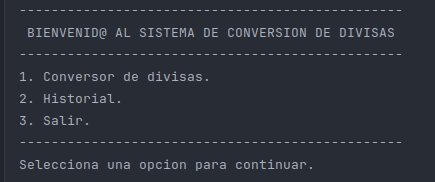
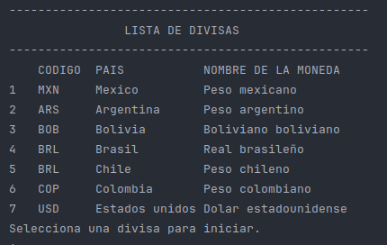

# Conversor de monedas.

Practicando con Java: Challenge Conversor de Monedas.

## Sobre el challenge.🚀

_Realiza solicitudes a una API de tasas de cambio, manipula datos JSON, filtra y muestra las monedas de interés._


### Pre-requisitos 📋

_Importar la biblioteca Gson en el entorno de desarrollo_

```
gson-2.20.1.jar
```
_Generar una KEY en [ExchangeRate-API](https://www.exchangerate-api.com/)_


### Galeria 📌
Mensaje de bienvenida y menu principal.


Lista de las divisas soportadas por el sistema de conversion.



## Construido con 🛠️
* [Java JDK](https://www.oracle.com/br/java/technologies/downloads/) - Java JDK: versión 11

## Autores ✒️
* **Ricardo Zamora Picazo** - [Ricardo ZP](https://github.com/pzric)
